# 🚀 Teil 1 / AWS EC2 mit Infrastructure as Code (IaC) – Learner Lab

## Ausgangslage

Infrastructure-as-Code (IaC) ist ein Ansatz zur automatisierten Bereitstellung und Verwaltung von IT-Infrastrukturen über Code. Anstatt manuell eine Instanz zu konfigurieren, wird ein vordefiniertes Skript verwendet, um eine AWS EC2-Instanz bereitzustellen. Dies sorgt für eine konsistente Umgebung und reduziert menschliche Fehler.

In diesem Workshop wird eine Ubuntu-basierte Instanz mit vorinstalliertem Docker und Podman aufgesetzt, die für Container-Labs genutzt wird.

---

# Schritt 1: AWS Academy Learner Lab starten

1. AWS Academy Website öffnen  
2. Auf **Student Login** klicken  
3. Mit AWS Academy Konto anmelden  
4. Im Dashboard auf **Learner Lab** klicken  
5. Unter Modules das Learner Lab starten (Launch)  
6. Auf **Start Lab** klicken  
7. Warten bis der Status neben AWS grün 🟢 ist  
8. AWS Management Console öffnen  

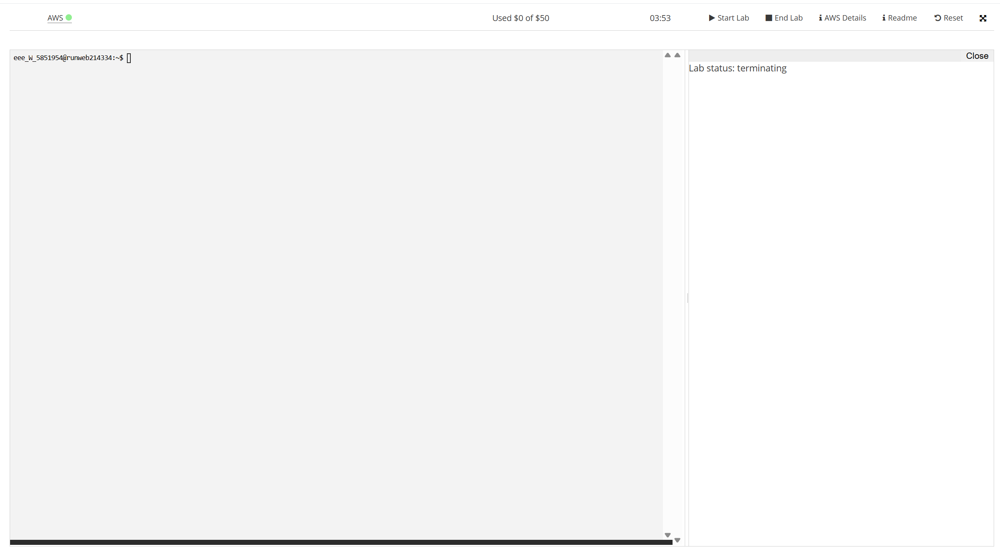

Nach Abschluss:  
- **Stop Lab** klicken, um Ressourcen zu pausieren  
- Erstellte EC2-Instanzen bleiben bestehen  

---

# Schritt 2: EC2-Instanz erstellen

## Basis-Konfiguration

- Name: `M169-Lab`  
- AMI: Neuestes Ubuntu Server Image  
- Instance Type: `t3.micro`  
- Key Pair: Erstellen oder auswählen (für SSH-Zugriff)  
- Network: Default VPC  

---

## Security Group – Inbound Rules

| Typ             | Protokoll | Port | Source     | Beschreibung        |
|-----------------|-----------|------|------------|---------------------|
| SSH             | TCP       | 22   | 0.0.0.0/0  | SSH Zugriff         |
| HTTP            | TCP       | 80   | 0.0.0.0/0  | Web Zugriff         |
| Custom TCP      | TCP       | 5000 | 0.0.0.0/0  | Port 5000 Forwarding |
| Custom TCP      | TCP       | 5001 | 0.0.0.0/0  | Port 5001 Forwarding |
| All ICMP - IPv4 | ICMP      | All  | 0.0.0.0/0  | Ping                |

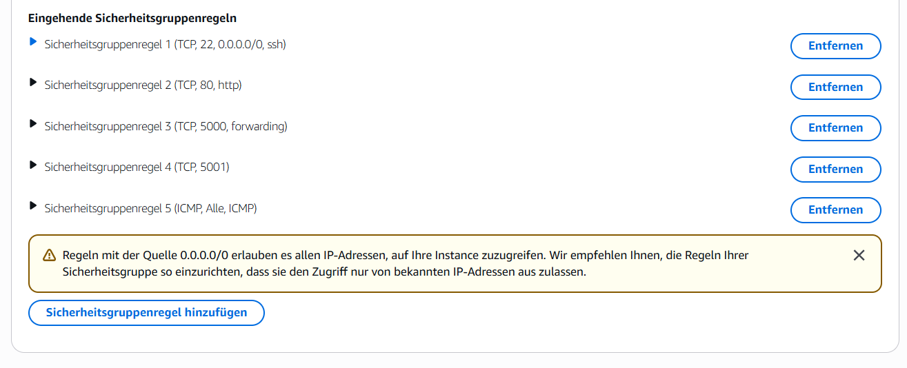

---

# cloud-init Script (IaC)

Unter **Advanced Details → User Data** folgendes Script einfügen:

```yaml
#cloud-config

packages:
  - apt-transport-https
  - ca-certificates
  - curl
  - gnupg-agent
  - software-properties-common

write_files:
  - path: /etc/sysctl.d/enabled_ipv4_forwarding.conf
    content: |
      net.ipv4.conf.all.forwarding=1

groups:
  - docker

runcmd:
  - curl -fsSL https://download.docker.com/linux/ubuntu/gpg | apt-key add -
  - add-apt-repository "deb [arch=amd64] https://download.docker.com/linux/ubuntu $(lsb_release -cs) stable"
  - apt-get update -y
  - apt-get install -y docker-ce docker-ce-cli containerd.io
  - systemctl start docker
  - systemctl enable docker
  - apt-get install podman -y
  - systemctl start podman
  - systemctl enable podman
  - usermod -aG docker ubuntu
```

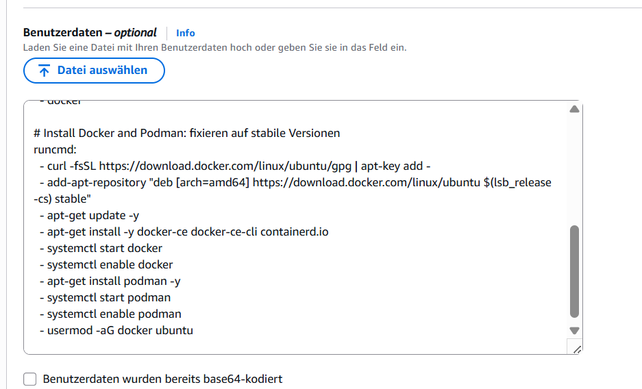

## Instanz starten

EC2-Instanz in AWS starten und warten, bis der Status **running** ist.

---

## SSH-Zugriff

### Speicherort Private Key (Windows Beispiel)

Verbindung herstellen

```bash
chmod 400 M169.pem
```

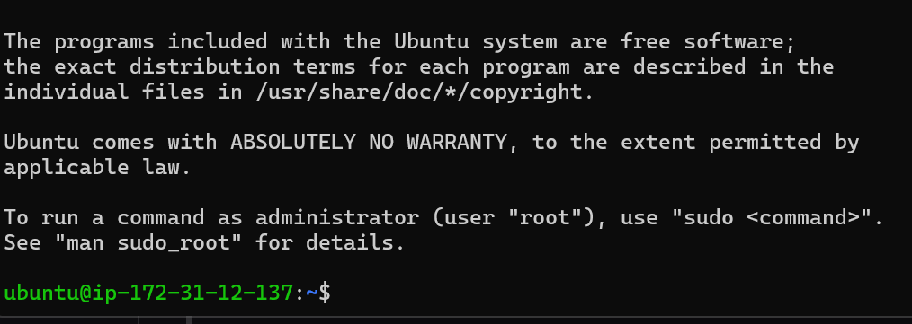

Installation überprüfen

### Docker prüfen

```bash
docker --version
```

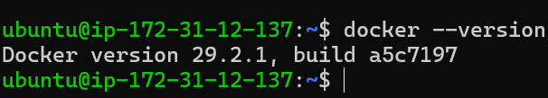

```bash
systemctl status docker
```

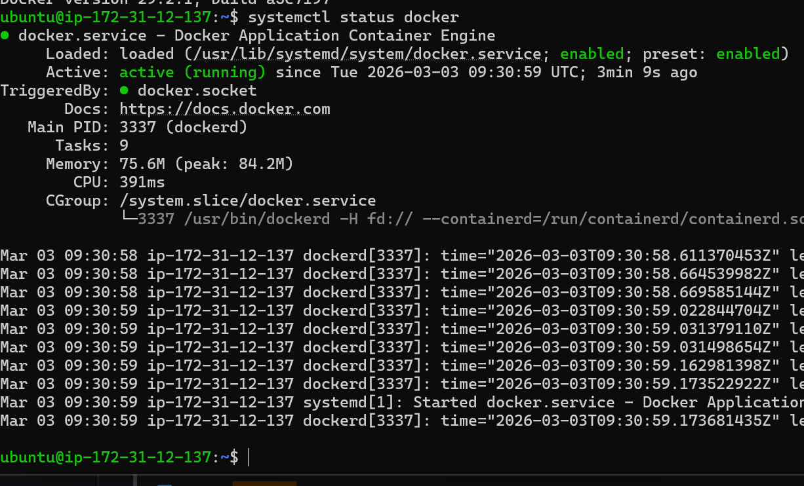

### Podman prüfen

```bash
podman --version
systemctl status podman
```

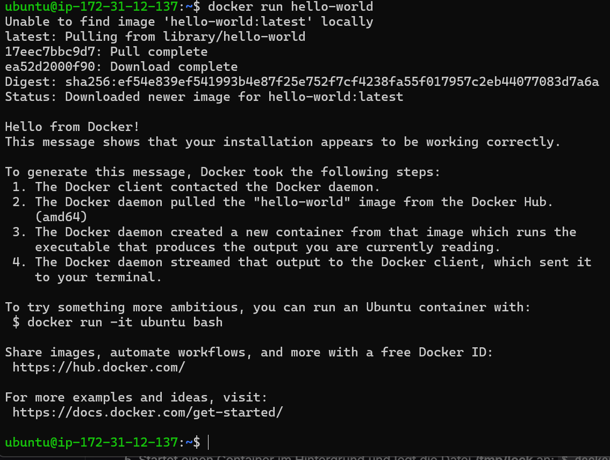

## Unterschied Docker vs. Podman

### Docker

- Benötigt Daemon (dockerd)
- Läuft mit Root-Rechten
- Zentrale Container-Verwaltung
- Weit verbreitet

### Podman

- Kein Daemon erforderlich
- Unterstützt rootless Mode
- Container laufen als User-Prozess
- Höhere Sicherheit

## Warum ist Podman „inactive“?

Podman läuft on-demand:

- Kein permanenter Hintergrunddienst
- Container starten direkt als Benutzerprozess
- Ressourcenschonend
- Sicherheitsvorteil durch rootless Betrieb

Das Verhalten inactive (dead) ist normal.

## Vorteile von Infrastructure as Code

- Automatisierte Bereitstellung
- Wiederholbare Konfiguration
- Reduktion menschlicher Fehler
- Schnellere Deployments
- Versionierbar (Git)
- Konsistente Umgebungen

## Leistungsnachweis

- ✔ EC2-Instanz via IaC erstellt
- ✔ SSH-Zugriff funktioniert
- ✔ Docker installiert und aktiv
- ✔ Podman installiert
- ✔ Unterschied Docker vs. Podman verstanden
- ✔ Repository vollständig dokumentiert

# Teil 2 / OCI-Images, Container und Registry – BASICS

## Ausgangslage

Moderne Softwareentwicklung erfordert flexible und portable Lösungen, um Anwendungen unabhängig von der Umgebung lauffähig zu machen. Klassische Installationen sind oft fehleranfällig, da sie von der spezifischen Systemkonfiguration abhängen.

Docker, Podman und ähnliche Tools lösen dieses Problem, indem sie Anwendungen und alle benötigten Abhängigkeiten in **Containern** verpacken. Dadurch laufen sie zuverlässig auf unterschiedlichen Systemen – egal ob Laptop, Server oder Cloud.

📌 In diesem Challenge geht es um die **Basic-Konzepte und Commands** rund um OCI-Images, Container und Registries. Es werden noch keine eigenen Images erstellt (kein Dockerfile, kein eigener Code).

---

# Warum starten wir mit Docker?

Docker ist:

- Industriestandard
- Weit verbreitet
- Gut dokumentiert
- Große Community
- Viele Tutorials und Beispiele

Podman wird später behandelt.

---

# Unterschied Docker vs. Podman

Docker:
- Benötigt zentralen Daemon (dockerd)
- Läuft meist mit Root-Rechten
- Sehr verbreitet im Enterprise-Bereich

Podman:
- Kein zentraler Daemon
- Arbeitet nutzerbasiert
- Unterstützt rootless Mode
- Höhere Sicherheit

---

# OCI-Images und Container

Ein OCI-Image ist eine Vorlage (Bauplan).  
Ein Container ist die laufende Instanz dieses Images.

## Vergleich mit Postpaketen

OCI-Image = Verpackung mit Smartphone + Zubehör  
Container = Das ausgepackte, laufende Smartphone  
Registry = Lager mit allen Paketen (z.B. Docker Hub)

---

# Wichtige Begriffe

**Registry**  
Online-Speicher für Images (Docker Hub, GitLab Registry)

**Docker-Daemon**  
Hintergrunddienst zur Verwaltung von Containern

**Docker-Client**  
CLI-Tool zur Kommunikation mit Docker (z.B. docker ps)

**OCI-Image**  
Bauplan für Container

**Image vs. Container**  
Image = Vorlage  
Container = Laufende Instanz

---

# Basic Docker Commands

## docker run

Startet einen neuen Container.

**Test:**

```bash
docker run hello-world
```


**Interaktive Shell:**

```bash
docker run -it ubuntu /bin/bash
```
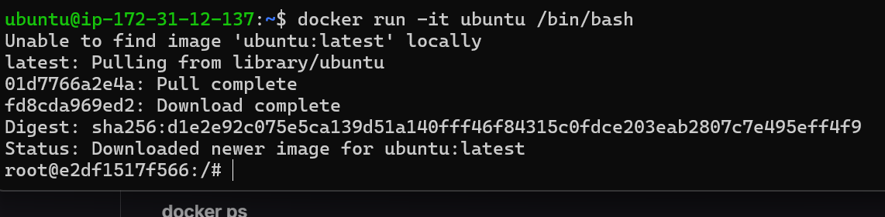

**Detached Mode:**

```bash
docker run -d ubuntu sleep 20
```
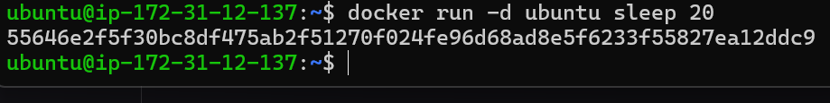

**Container automatisch löschen:**

```bash
docker run -d --rm ubuntu sleep 20
```


**Aktive Container:**

```bash
docker ps
```
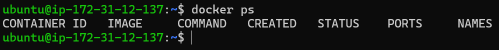

**Alle Container:**

```bash
docker ps -a
```
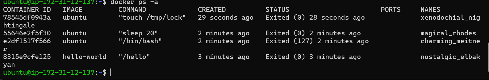

**Nur IDs:**

```bash
docker ps -a -q
```
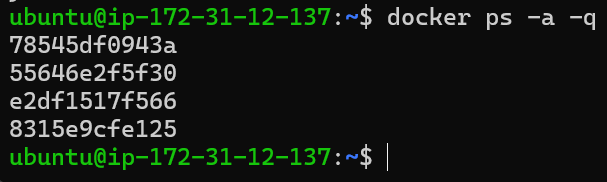


**Lokale Images anzeigen:**

```bash
docker images
```
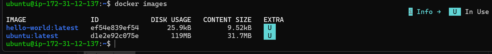

**Alternative:**

```bash
docker image ls
```

## Container und Images löschen

**Container löschen:**

```bash
docker rm <NAME>
```

**Image löschen:**

```bash
docker rmi ubuntu
```

## Container starten

**Gestoppten Container starten:**

```bash
docker start <ID>
```

## Container stoppen / killen

**Sauber stoppen:**

```bash
docker stop <ID>
```

**Sofort beenden:**

```bash
docker kill <ID>
```

## Informationen zu Containern

**Logs anzeigen:**

```bash
docker logs <ID>
```

**Details anzeigen:**

```bash
docker inspect <ID>
```

**Änderungen anzeigen:**

```bash
docker diff <ID>
```

**Prozesse anzeigen:**

```bash
docker top <ID>
```

## 🟢 2. Teil-Challenge

### SSH-Verbindung zur EC2

```bash
ssh -i M169.pem ubuntu@<Public-IP>
```

### Docker überprüfen

```bash
docker info
docker --version
```

### Erste Docker-Befehle

**Images anzeigen:**

```bash
docker image ls
```

**Laufende Container:**

```bash
docker ps
```

**Image aus Registry laden:**

```bash
docker pull hello-world
```

**Container starten:**

```bash
docker run hello-world
```

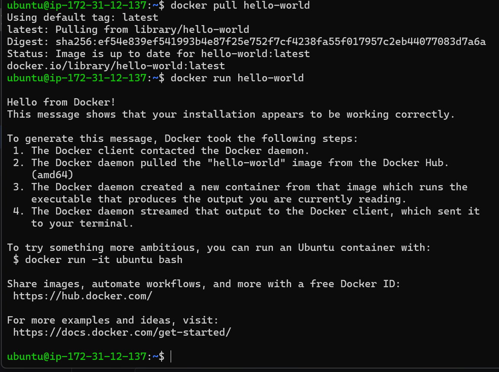

**Container stoppen und löschen:**

```bash
docker stop <ID>
docker rm <ID>
```

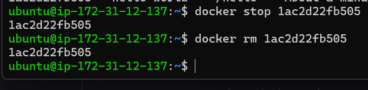

### Sonder-Challenge – NGINX Webserver

**Container starten:**

```bash
docker run -d -p 8080:80 nginx
```

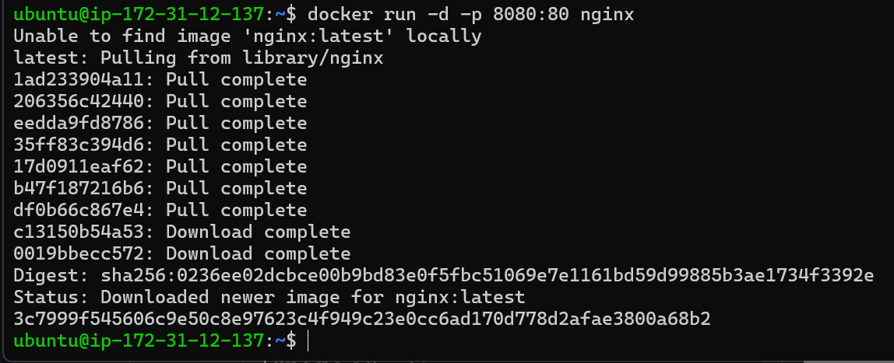

**Browser öffnen:**

```text
http://<Public-IP>:8080
```

Falls kein Zugriff:

- Security Group um Port 8080 erweitern

**Überprüfung:**

```bash
docker container ls
docker image ls
```

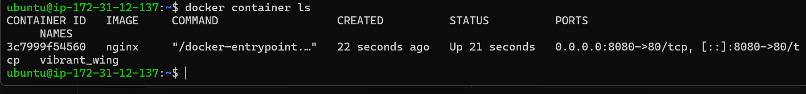

**Ergebnis:**  
NGINX Standard-Webseite sichtbar

## Ziel der Übung

- Grundbegriffe verstehen
- Unterschied Image vs. Container kennen
- Registry verstehen
- Docker-Befehle ausführen können
- Container isoliert erklären können

## Teil-Leistungsnachweis

- ✔ docker run, docker ps, docker stop ausführen
- ✔ Container starten und Status prüfen
- ✔ Unterschied Container vs. VM erklären
- ✔ Isolation von Containern erklären

## Fachgespräch

- Image vs. Container erklären
- Bedeutung von Docker Hub erklären
- Vorteile isolierter Container erklären
- Bonus: nginx-Webserver live demonstrieren

# 🐳 Teil 3 / OCI-Images mit Docker – RUN & ADMINISTRATION

## Ausgangslage

Container-Technologien wie Docker ermöglichen es, Anwendungen isoliert auszuführen. Zwei zentrale Konzepte spielen dabei eine wichtige Rolle:

- **Networking**
- **Volumes**

Diese Konzepte erlauben:
- Zugriff von außen auf Container
- Persistente Datenspeicherung über den Container-Lebenszyklus hinaus

---

# Container Networking

Wenn ein Webserver in einem Container läuft, muss dieser über **Ports** erreichbar gemacht werden.

Dies geschieht mit:

- `-p` → explizite Portweiterleitung
- `-P` → automatische Portzuweisung

## Beispiele

MySQL Container an Host-Port 3306 binden:

```bash
docker run --rm -d -p 3306:3306 mysql
```
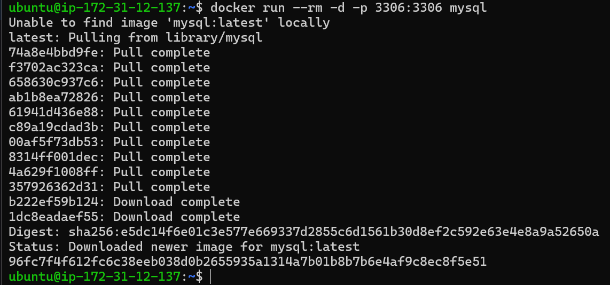
Automatische Portvergabe:

```bash
docker run --rm -d -P mysql
```
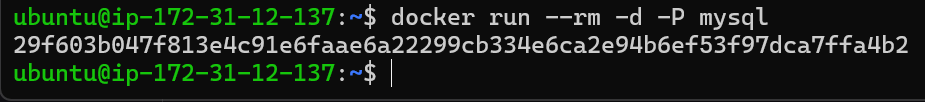

### Dockerfile – Ports freigeben

Ports werden im Dockerfile mit EXPOSE definiert:

```dockerfile
EXPOSE 3306
```

## Netzwerkmodi

- Bridge (Standard)
- None (keine Netzwerkschnittstelle)
- Host (nutzt Host-Netzwerk direkt)

Zusätzlich: Benutzerdefinierte Netzwerke möglich

## Container Volumes

Container verlieren ihre Daten beim Löschen.  
Volumes ermöglichen persistente Speicherung.

## Vorteile von Volumes

- Daten bleiben nach Container-Löschung erhalten
- Mehrere Container können Daten teilen
- Performance-optimiert
- Unabhängig vom Container-Lebenszyklus
- Docker löscht Volumes nie automatisch

## Beispiel Volume-Mount

MySQL-Datenverzeichnis auf Host einhängen:

```bash
docker run -d -p 3306:3306 -v ~/data/mysql:/var/lib/mysql --name mysql --rm mysql
```

Dateien prüfen:

```bash
ls -l ~/data/mysql
```
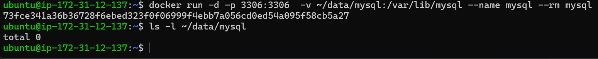


## Hands-on Lab – MariaDB mit Docker

**Ziel:**  
MariaDB in einem Container betreiben und persistent speichern.

## Lernziele

- Container starten, stoppen, löschen
- Verbindung mit HeidiSQL herstellen
- Port-Forwarding einrichten
- Persistente Speicherung mit Volumes
- Troubleshooting durchführen

## Ablauf

### Schritt 1 – Vorbereitung

- HeidiSQL installieren
- Docker Images prüfen
- MariaDB-Image laden
- Container starten

### Schritt 2 – Container verwalten

- Container stoppen
- Container starten
- Container löschen
- Security Group ggf. anpassen

### Schritt 3 – Datenbank erstellen

Verbindung via HeidiSQL herstellen

Datenbank erstellen:


(XXX = erste drei Buchstaben des Nachnamens)

### Schritt 4 – Datenpersistenz testen

- Volume einrichten
- Container löschen
- Container neu erstellen
- Prüfen, ob Datenbank weiterhin existiert

## Ziel der Übung

- MariaDB läuft im Container
- Zugriff via HeidiSQL möglich
- Port-Forwarding funktioniert
- Daten bleiben persistent gespeichert
- Volumes korrekt eingesetzt

## 3. Teil-Leistungsnachweis

- ✔ Verbindung via HeidiSQL möglich (Live-Demo)
- ✔ Wechsel in laufenden Container möglich
- ✔ Begriff „Persistent“ erklären können
- ✔ Container löschen & neu erstellen ohne Datenverlust
- ✔ Dokumentation im Repo mit Screenshots vorhanden

# 🐳 Teil 4 / OCI-Images mit Docker – BUILD & CUSTOMIZATION

## Ausgangslage

In der vorherigen Challenge haben wir gelernt, wie man bestehende OCI-Images aus einer Registry bezieht und daraus Container startet. Nun geht es einen Schritt weiter: Wir wollen **eigene Images erstellen** und mit Inhalten anpassen.

📌 In dieser Challenge geht es darum, ein eigenes OCI-Image zu erstellen, zu konfigurieren und zu erweitern. Dabei lernen wir Konzepte wie **Dockerfile**, den **docker build**-Prozess und den Umgang mit benutzerdefinierten Images.

---

# Warum eigene Images erstellen?

Eigene Images ermöglichen es, Software in einer konsistenten und portablen Umgebung bereitzustellen. Entwickler können Images so gestalten, dass alle benötigten Abhängigkeiten enthalten sind, und diese dann unkompliziert in verschiedenen Umgebungen nutzen.

---

# Dockerfile und Image-Building

Wir nutzen ein **Dockerfile**, um ein OCI-Image zu definieren, und den Befehl **docker build**, um es zu erstellen. Anschließend kann das Image in eine Registry hochgeladen und wiederverwendet werden.

---

# ℹ️ Dockerfile

Ein Dockerfile ist eine Textdatei mit Anweisungen, wie ein Image aufgebaut sein soll. Es enthält Informationen darüber, welche Basis verwendet wird, welche Dateien hinzugefügt werden und welche Befehle ausgeführt werden sollen.

Vorgehen:
- Verzeichnis erstellen
- Datei **Dockerfile** anlegen (grosses D, keine Endung)
- Befehle definieren, die Docker beim Build ausführt

---

# Begriffe, die behandelt werden

- **Dockerfile**: Textdatei mit Anweisungen für den Bau eines OCI-Images  
- **docker build**: Befehl, um aus einem Dockerfile ein Image zu erstellen  
- **Layering**: Jede Dockerfile-Anweisung erzeugt einen neuen Layer  
- **Caching**: Unveränderte Layer werden wiederverwendet, um Builds zu beschleunigen  

---

# Layer / Imageschichten

Jede Anweisung in einem Dockerfile führt zu einer neuen Schicht (Layer), die wieder zum Starten eines neuen Containers genutzt werden kann.

Ablauf:
- Container mit vorherigem Layer starten
- Dockerfile-Anweisung ausführen
- Neues Image speichern
- Temporären Container löschen

---

# Anweisungen im Dockerfile (Kurzbeschreibung)

## FROM
Base Image auswählen (z.B. `ubuntu:24.04`)

## ADD
Kopiert Dateien aus Build Context oder URLs ins Image

## CMD
Standard-Befehl beim Container-Start (falls ENTRYPOINT existiert: als Argument)

## COPY
Kopiert Dateien aus Build Context ins Image

## ENV
Setzt Umgebungsvariablen im Image

## EXPOSE
Dokumentiert Ports, an denen ein Dienst lauscht

## MAINTAINER
Autor-Metadaten (heute oft via LABEL ersetzt)

## RUN
Führt Befehle beim Build im Container aus und speichert Ergebnis als Layer

## SHELL
Setzt die Shell für folgende RUN-Befehle (bash/zsh/powershell möglich)

## USER
Setzt den Benutzer für folgende Befehle

## VOLUME
Deklariert ein Verzeichnis als Volume (persistente Daten)

## WORKDIR
Setzt Arbeitsverzeichnis für folgende Anweisungen

---

# Beispiel eines einfachen Dockerfiles

```dockerfile
# Basis-Image
FROM ubuntu:latest

# Metadaten (optional)
LABEL maintainer="Ihr Name <email@example.com>"

# Pakete installieren
RUN apt-get update && apt-get install -y curl

# Standard-Befehl beim Start
CMD ["bash"]
```

## Image build (tag & push)

### Build Context

Der Befehl docker build benötigt:

- Dockerfile
- Build Context (lokale Dateien/Verzeichnisse für COPY/ADD)

Build ausführen:

```bash
docker build -t mein-image:1.0 .
```

- `-t` setzt Name und Tag des Images
- `.` bedeutet: Dockerfile liegt im aktuellen Verzeichnis (Build Context = aktuelles Verzeichnis)

## Hands-on Lab

In diesem Lab erstellen, modifizieren und verwalten Sie OCI-Images mit Docker über zwei Ansätze:

- Manuelle Anpassung + Commit eines Containers
- Automatisierte Image-Erstellung mit Dockerfile

### Variante 1: Manuelle Anpassung und Commit eines Containers

**Ziel**

Neues Image aus einem laufenden, aktualisierten Container erstellen.

**Vorgehen (grob)**

- Ubuntu-Container starten und betreten
- Status prüfen (Image, Größe, Layer, Container-Status)
- Container anpassen: apt update und Pakete installieren (cowsay, fortune)
- Programme testen
- Container-Zustand in neues Image committen
- Neues Image validieren (Container starten und prüfen)

### Variante 2: Automatisierte Image-Erstellung mit Dockerfile

**Ziel**

Neues Image reproduzierbar über Dockerfile bauen.

**Vorgehen (grob)**

- Dockerfile erstellen (Ubuntu + cowsay + fortune + Apache)
- index.html erstellen mit persönlicher Nachricht
- Image bauen und testen (Apache/Webserver)
- Bestehende Container löschen (Namenskonflikte vermeiden)
- Dockerfile anpassen: statt Apache soll cowsay direkt starten
- Neues Image bauen und testen
- Ergebnis vergleichen (Image-History / Layer / Output)

ℹ️ Info

Ziel ist, die Grundlagen der Containerisierung und Image-Verwaltung zu verstehen – von manuellen Container-Änderungen bis zu reproduzierbaren Builds mit Dockerfile.

## Hilfe

Für detaillierte Schritte:

- Anleitung: Docker build Images erstellen
- Tutorial (21min, Marco Berger) als Walkthrough

## 🟢 4. Teil-Challenge

Führen Sie das dokumentierte Lab durch (Tutorial 21 Min. als Unterstützung).

**Ziel**

Am Ende erfüllt:

- Neues Image aus aktualisiertem Ubuntu-Container mit Zusatzpaketen
- Dockerfile-basiertes Image (Apache oder cowsay Output)
- Verständnis der Layer-Struktur (Vergleich Image-Historien)
- Container sicher starten, testen, stoppen, löschen
- Reproduzierbare Build-Prozesse (Commit vs Dockerfile)

## 4a. Teil-Leistungsnachweis – Lab & Doku im Repo

- ✔ Screenshot: Container mit eigener index.html:  
  Hello from M169 Container
- ✔ Ubuntu-Container starten, hinein wechseln, Änderungen machen, verlassen
- ✔ Container-Zustand in neues Image committen und Layer-Veränderung nachvollziehen (Variante 1)
- ✔ Dockerfile erstellen, modifizieren, Image bauen (Variante 2)
- ✔ Live-Demo: Container aus neuem Image starten und Funktion nachweisen  
  (cowsay/fortune oder Webserver)
- ✔ Repo-Doku nachvollziehbar mit eigenen Screenshots

## 4b. Teil-Leistungsnachweis – Fachgespräch

- ✔ Unterschied erklären:  
  Manuelle Container-Anpassung (Commit) vs automatisierte Image-Erstellung (Dockerfile)

# 🌐 Teil 5 / Container Netzwerk – VERTIEFUNG

## Ausgangslage

In den vorherigen Labs wurden bereits Serverdienste wie MySQL oder ein Webserver in Containern betrieben. Der Zugriff von außen erfolgt über **Port-Mapping**.

Mit `-p` oder `-P` im `docker run`-Befehl werden Container-Ports auf den Host weitergeleitet.

Beispiel:

```bash
docker run --rm -d -p 3306:3306 mysql
```

Automatische Portvergabe:

```bash
docker run --rm -d -P mysql
```


## EXPOSE im Dockerfile

Ports werden im Dockerfile dokumentiert mit:

```dockerfile
EXPOSE 3306
```

⚠️ EXPOSE öffnet keinen Port automatisch – es dokumentiert nur den vorgesehenen Port.

## Container-Networking

Docker-Netzwerke können unabhängig von Containern erstellt und verwaltet werden.

## Standard-Netzwerke

### bridge

- Standard-Netzwerk
- Port-Mapping möglich
- Container können sich intern erreichen

### host

- Container nutzt direkt das Host-Netzwerk
- Kein Port-Mapping nötig
- Weniger Isolation

### none

- Keine Netzwerkschnittstelle
- Vollständig isoliert

## Wichtige Befehle

### Netzwerke anzeigen

```bash
docker network ls
```


### Netzwerk detailliert inspizieren

```bash
docker network inspect bridge
```

### Container ohne Netzwerk starten

```bash
docker run --network=none -it --name c1 --rm busybox
ifconfig
```


### Container mit Host-Netzwerk starten

```bash
docker run --network=host -itd --name c1 --rm busybox
docker inspect host
```


### Eigenes Bridge-Netzwerk erstellen

```bash
docker network create --driver bridge xxx-mynetwork
```

### Netzwerk überprüfen

```bash
docker network inspect xxx-mynetwork
```

Wichtig:

- Subnetz-ID
- CIDR (z.B. 172.18.0.0/16)

## Container im eigenen Netzwerk starten

### MySQL starten:

```bash
docker run --rm -d --network=xxx-mynetwork --name mysql mysql
```

### Ubuntu starten:

```bash
docker run -it --rm --network=xxx-mynetwork --name ubuntu ubuntu:24.10 bash
```

Verbindung im Ubuntu-Container testen:

```bash
apt-get update && apt-get install -y curl
curl -f http://mysql:3306
```

**Ergebnis:**  
Container können sich über den Containernamen erreichen.

## Netzwerke löschen

**Einzelnes Netzwerk löschen:**

```bash
docker network rm xxx-mynetwork
```

**Nicht verwendete Netzwerke löschen:**

```bash
docker network prune
```


## 🟢 5. Teil-Challenge

### Ziel

Verständnis der Docker-Netzwerke:

- Netzwerkmodi kennen
- Eigene Netzwerke erstellen
- Container miteinander verbinden
- Netzwerke analysieren und löschen

### Erwartete Resultate

- ✔ Vorhandene Netzwerke analysiert (`docker network ls`)
- ✔ Eigenes Netzwerk `xxx-mynetwork` erstellt
- ✔ Subnetz-ID und CIDR dokumentiert
- ✔ MySQL-Container im eigenen Netzwerk gestartet
- ✔ Mit `docker network inspect` überprüft
- ✔ Ungenutzte Netzwerke gelöscht
- ✔ Dokumentation mit Screenshots im Repo vorhanden

## Leistungsnachweis

- ✔ Netzwerke anzeigen und inspizieren
- ✔ Eigenes Netzwerk erstellt
- ✔ Container im Netzwerk nachweisbar
- ✔ Netzwerke korrekt löschen können
- ✔ Ablauf vollständig dokumentiert
